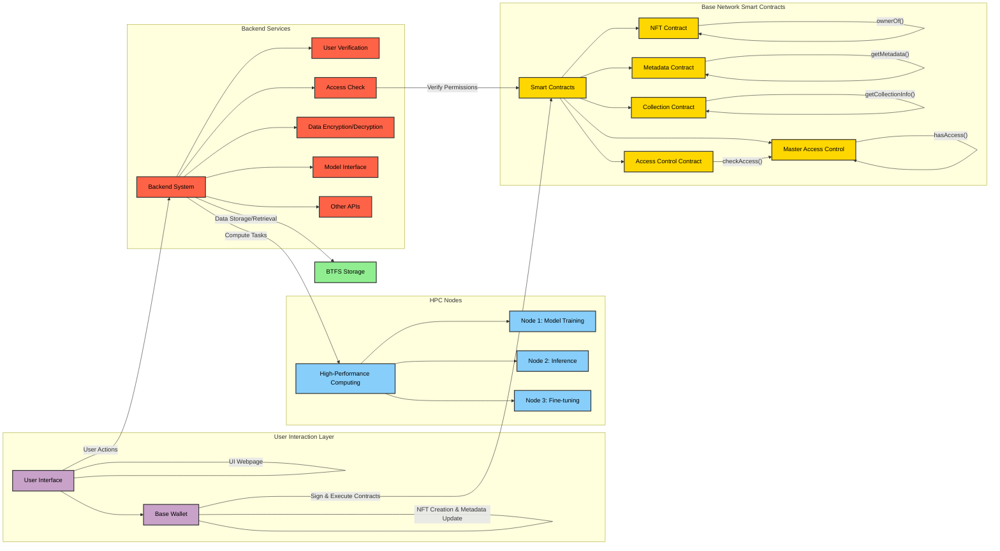

# NeuraNFT

NeuraNFT is a pioneering platform built on the Base blockchain that aims to tokenize intelligence. It enables the creation of NFTs representing AI models and data, with a sophisticated permission management system for granular control over access and usage rights. By addressing key challenges in the current AI ecosystem, NeuraNFT seeks to create a more equitable, secure, and innovative environment for AI development and deployment.


## How to run the project

1. Clone the repository:

   ```bash
   git clone git@github.com:Projects-by-Harsh-and-Sid/NeuraNFT_Base.git
   ```
2. Run docker-compose to start the HPc node

   ```bash
   cd hpc_node
   docker-compose up
   ```

3. Run the following command to deploy the smart contracts on the Base blockchain:

   ```bash
   cd smart_contracts/truffle_compiled_contract
   truffle migrate --network base --reset
   ```

4. Start the React frontend and backend

   ```bash
   docker-compose up --build
   ```

5. Stop containers
   
   ```bash
   docker-compose down
   ```

### Note check these files for local deployment

<u>__Frontend__</u>

`frontend\src\endpoints.json`

for local deployment, the file should look like this:

```json
{"BACKEND_URL": "http://localhost:6010"}
```
for web deployment, the file should look like this:

```json
{"BACKEND_URL": "https://base.backend.neuranft.com"}
```
> replace `https://base.backend.neuranft.com` with the actual backend URL

<u>__Backend__</u>

`master_node\app\__init__.py`

for local deployment, the file should look like this:

```python

app.config["Load_balancer_Endpoints"] = {
    "hpcEndpoint": "http://localhost",
    "hpcEndpointPort": "5500",
}

app.config["filestorage_endpoint"] = "http://localhost:5500"
```

for web deployment, the file should look like this:

```python

app.config["Load_balancer_Endpoints"] = {
    "hpcEndpoint": "https://base.backend.neuranft.com",
    "hpcEndpointPort": "443",
}

app.config["filestorage_endpoint"] = "https://base.backend.neuranft.com"
```
> replace `https://base.backend.neuranft.com` with the actual backend URL

_____


## Table of Contents

- [NeuraNFT](#neuranft)
  - [How to run the project](#how-to-run-the-project)
    - [Note check these files for local deployment](#note-check-these-files-for-local-deployment)
  - [Table of Contents](#table-of-contents)
  - [Documentation](#documentation)
  - [Key Features](#key-features)
  - [Problem Statement](#problem-statement)
  - [Architecture](#architecture)
    - [Smart Contracts](#smart-contracts)
    - [Balancer Nodes](#balancer-nodes)
    - [Frontend](#frontend)
    - [Backend](#backend)
    - [Operational Flow](#operational-flow)
  - [Technologies Used](#technologies-used)
  - [Smart Contracts](#smart-contracts-1)
  - [Future Developments](#future-developments)
  - [Architecture Diagram](#architecture-diagram)
    - [Smart Contract Architecture](#smart-contract-architecture)
- [Migration Output](#migration-output)

## Documentation

We have detailed documentation available in the `/smart_contracts/` directory to help you understand and work with the NeuraNFT smart contracts:

1. [Overview](/smart_contracts/01_overview.md): Provides a general overview of the NeuraNFT smart contract system and its components.

2. [Compiling Smart Contracts](/smart_contracts/02_compiling_smart_contracts.md): Explains the process of compiling the smart contracts and outlines the project structure.

3. [Migration](/smart_contracts/03_migration.md): Details the deployment script and process, including updates to the Solidity version 0.8.7.

4. [Testing on CLI](/smart_contracts/04_testing_on_cli.md): Guides you through testing the smart contracts using the command-line interface.

5. [Code Testing](/smart_contracts/05_code_testing.md): Covers the code testing process and best practices for ensuring contract reliability.

6. [Build Data Use in React WebApp](/smart_contracts/06_build_data_use_in_react_webapp.md): Explains how to integrate the compiled contract data into a React web application.

These documents provide comprehensive guidance on working with the NeuraNFT smart contracts, from compilation to testing and integration with the frontend.

For Information about the HPC node setup, please refer to the `/hpc_node/` document:

1. [HPC Node Setup](/hpc_node/hpc_node.md): Provides a detailed guide on setting up the HPC nodes for the NeuraNFT platform.


## Key Features

1. **NFT Creation for AI Models and Data**: Tokenize AI models and datasets as unique digital assets.
2. **Granular Permission Management**: Fine-tuned access control for different levels of data and model usage.
3. **Secure, Encrypted Data Storage**: Utilizes BTFS (BitTorrent File System) for decentralized and secure storage.
4. **Controlled Access to Models and Data**: Smart contract-based access control ensures only authorized users can interact with the assets.
5. **Secure Model Deployment and Inference**: Enables secure deployment and use of AI models without compromising intellectual property.
6. **AI Marketplace**: A decentralized marketplace for buying, selling, and leasing AI models and datasets.

## Problem Statement

NeuraNFT addresses several key challenges in the current AI ecosystem:

- Lack of control and fair compensation for data owners
- Difficulties for independent creators in monetizing their innovations
- Limited data control and high costs for end users
- Corporate hesitation to use centrally deployed models due to data privacy concerns
- IP infringement risks for model owners when hosting on client servers
- Limited true ownership and transferability of AI assets
- Inefficient resource management for personalized AI

## Architecture

NeuraNFT's architecture is designed with security, scalability, and user control at its forefront. It consists of several key components:

### Smart Contracts
- **MasterAccessControl**: Manages overall access rights across the platform.
- **NFTAccessControl**: Handles granular permissions for individual NFTs.
- **NFTMetadata**: Stores and manages metadata for NFTs.
- **NFTContract**: Implements core NFT functionality (minting, transferring, etc.).
- **CollectionContract**: Manages collections of NFTs.

### Balancer Nodes
Responsible for verifying access requests, ensuring only authorized parties can interact with the models and data.

### Frontend
- Provides user interface for interacting with the platform.
- Handles message signing for verification purposes.

### Backend
- Manages signature verification.
- Performs permission checks.
- Handles data decryption and model deployment.

### Operational Flow
1. User creates an NFT representing their AI model or dataset.
2. Owner grants varying levels of permissions to other users.
3. For access requests, a balancer node sends a verification message.
4. Frontend signs the message and sends it to the backend.
5. Backend verifies the signature and checks permissions.
6. If permissions match, data is decrypted or model is deployed for inference.

## Technologies Used

- **Base Blockchain**: Foundation of the decentralized system.
- **Smart Contracts (Solidity)**: Implements core logic for NFTs and permissions.
- **React**: Powers the frontend user interface.
- **Python**: Drives backend operations.
- **Python Encryption Libraries**: Ensure data security throughout the system.

## Smart Contracts

The following smart contracts have been deployed on the Base testnet:

- MasterAccessControl: [0x52AD5a6D11a1D68736894F4eab33CCD594E1db5A](https://sepolia.basescan.org/address/0x52AD5a6D11a1D68736894F4eab33CCD594E1db5A)
- NFTAccessControl: [0xf9179350E92092F283dC34B5E99F53BfF96effbf](https://sepolia.basescan.org/address/0xf9179350E92092F283dC34B5E99F53BfF96effbf)
- NFTMetadata: [0x62B5C46B0eCDda777B98d3ca5100DCa4d0532026](https://sepolia.basescan.org/address/0x62B5C46B0eCDda777B98d3ca5100DCa4d0532026)
- NFTContract: [0x112bC2e4d638839162686B8EAb2F1161562BDbAB](https://sepolia.basescan.org/address/0x112bC2e4d638839162686B8EAb2F1161562BDbAB)
- CollectionContract: [0xc367B82Aed2625e0e592283954E6079B01f0cD48](https://sepolia.basescan.org/address/0xc367b82aed2625e0e592283954e6079b01f0cd48)

## Future Developments

1. **Smart Contract Optimization**: Refine contracts for better performance and lower fees.
2. **Advanced NFT Functionalities**: Implement model combination and fractional ownership features.
3. **Robust Marketplace Development**: Create a comprehensive marketplace with advanced search and discovery features.
4. **Governance Mechanisms**: Introduce decentralized governance for community-driven decision-making.
5. **Expanded Compute Network**: Develop a more efficient decentralized compute network for model deployment.
6. **AI-to-AI Interaction Protocols**: Enable secure interactions between AI models within the ecosystem.
7. **Cross-chain Interoperability**: Explore integration with other blockchain networks.
8. **Industry Partnerships**: Establish partnerships with AI researchers, companies, and institutions.

## Architecture Diagram



### Smart Contract Architecture
> Kindly open the image in a new tab to see in detial


# Migration Output
```shell

truffle migrate --network base --reset

Compiling your contracts...
===========================
> Compiling .\contracts\CollectionContract.sol
> Compiling .\contracts\MasterAccessControl.sol
> Compiling .\contracts\Migrations.sol
> Compiling .\contracts\NFTAccessControl.sol
> Compiling .\contracts\NFTContract.sol
> Compiling .\contracts\NFTMetadata.sol
> Artifacts written to F:\Projects\03 Hackathon\NeuraNFT Hackathons\Base hackathon\NeuraNFT_Base\smart_contracts\truffle_compiled_contract\build\contracts
> Compiled successfully using:
   - solc: 0.8.19+commit.7dd6d404.Emscripten.clang


Starting migrations...
======================
> Network name:    'base'
> Network id:      84532
> Block gas limit: 60000000 (0x3938700)


1_initial_migration.js
======================

   Replacing 'Migrations'
   ----------------------
   > transaction hash:    0x705ea50d0abf8bb25256c4c20f759cd0dbf5ce07e751e180b8f290972787f7b7
   > Blocks: 4            Seconds: 8
   > contract address:    0x596522432614C2ee07284A964077B9974D6744e5
   > block number:        16934410
   > block timestamp:     1729637108
   > account:             0x43ADAc5516f8E2D3d2BD31276BeC343547ee6612
   > balance:             0.10950934976490596
   > gas used:            250212 (0x3d164)
   > gas price:           2.500204425 gwei
   > value sent:          0 ETH
   > total cost:          0.0006255811495881 ETH

   > Saving migration to chain.
   > Saving artifacts
   -------------------------------------
   > Total cost:     0.0006255811495881 ETH


2_deploy_master_access_control.js
=================================

   Replacing 'MasterAccessControl'
   -------------------------------
   > transaction hash:    0x336cb581d5e4fc3cba9ba94bb4f88838989e35e6f0c1721d21dac2f25e88d6f9
   > Blocks: 2            Seconds: 5
   > contract address:    0xEAD39C0363378B3100cB8C89820f71353136EBd0
   > block number:        16934421
   > block timestamp:     1729637130
   > account:             0x43ADAc5516f8E2D3d2BD31276BeC343547ee6612
   > balance:             0.108009885253774519
   > gas used:            553822 (0x8735e)
   > gas price:           2.500201361 gwei
   > value sent:          0 ETH
   > total cost:          0.001384666518151742 ETH

MasterAccessControl deployed at: 0xEAD39C0363378B3100cB8C89820f71353136EBd0
Addresses saved to base_addresses.json
   > Saving migration to chain.
   > Saving artifacts
   -------------------------------------
   > Total cost:     0.001384666518151742 ETH


3_deploy_nft_access_control.js
==============================

   Replacing 'NFTAccessControl'
   ----------------------------
   > transaction hash:    0x83d60c74feb818b19f92524d86b4e337961f493da0e13f6aaab3fe243cdd9ba5
   > Blocks: 2            Seconds: 4
   > contract address:    0x2c6993608197B40ae0d0D1042829541067ac761e
   > block number:        16934428
   > block timestamp:     1729637144
   > account:             0x43ADAc5516f8E2D3d2BD31276BeC343547ee6612
   > balance:             0.10188402270196456
   > gas used:            2421325 (0x24f24d)
   > gas price:           2.500200422 gwei
   > value sent:          0 ETH
   > total cost:          0.00605379778679915 ETH

NFTAccessControl deployed at: 0x2c6993608197B40ae0d0D1042829541067ac761e
Granted access to NFTAccessControl in MasterAccessControl
Addresses saved to base_addresses.json
   > Saving migration to chain.
   > Saving artifacts
   -------------------------------------
   > Total cost:     0.00605379778679915 ETH


4_deploy_nft_metadata.js
========================

   Replacing 'NFTMetadata'
   -----------------------
   > transaction hash:    0xa8dfe12625c2da58d66b85f604ec52990d23284734bcde3a863f8ed3232f6795
   > Blocks: 4            Seconds: 8
   > contract address:    0x13846e6fDe06853f6CC822A58f97AdbEbF1e6AFd
   > block number:        16934443
   > block timestamp:     1729637174
   > account:             0x43ADAc5516f8E2D3d2BD31276BeC343547ee6612
   > balance:             0.097445312598784868
   > gas used:            1697685 (0x19e795)
   > gas price:           2.500197063 gwei
   > value sent:          0 ETH
   > total cost:          0.004244547050899155 ETH

NFTMetadata deployed at: 0x13846e6fDe06853f6CC822A58f97AdbEbF1e6AFd
Granted access to NFTMetadata in MasterAccessControl
Granted access to NFTMetadata in NFTAccessControl
Addresses saved to base_addresses.json
   > Saving migration to chain.
   > Saving artifacts
   -------------------------------------
   > Total cost:     0.004244547050899155 ETH


5_deploy_nft_contract.js
========================

   Replacing 'NFTContract'
   -----------------------
   > transaction hash:    0x45ca808cfcccdcb21bbf6fdd083ce1eb3ba540298c1e7a43ad8fc862cef7bbb9
   > Blocks: 2            Seconds: 4
   > contract address:    0xAc537d070AcfA1F0C6df29a87b5d63c26Fff6DcE
   > block number:        16934472
   > block timestamp:     1729637232
   > account:             0x43ADAc5516f8E2D3d2BD31276BeC343547ee6612
   > balance:             0.088417104019242902
   > gas used:            3307161 (0x327699)
   > gas price:           2.500188987 gwei
   > value sent:          0 ETH
   > total cost:          0.008268527510435907 ETH

NFTContract deployed at: 0xAc537d070AcfA1F0C6df29a87b5d63c26Fff6DcE
Granted access to NFTContract in MasterAccessControl
Granted access of NFTAccessControl to NFTContract in MasterAccessControl
Granted access of NFTMetadata to NFTContract in MasterAccessControl
Granted access to NFTContract in NFTAccessControl
Granted access to NFTContract in NFTMetadata
Addresses saved to base_addresses.json
   > Saving migration to chain.
   > Saving artifacts
   -------------------------------------
   > Total cost:     0.008268527510435907 ETH


6_deploy_collection_contract.js
===============================

   Replacing 'CollectionContract'
   ------------------------------
   > transaction hash:    0x89b1bf28cebf843b88f57c376f7639250a0907f6e56bcd838ffe7c6e54649f3a
   > Blocks: 2            Seconds: 4
   > contract address:    0x536446035eF24cb011a3B55f0627df2Fad083F67
   > block number:        16934502
   > block timestamp:     1729637292
   > account:             0x43ADAc5516f8E2D3d2BD31276BeC343547ee6612
   > balance:             0.082414437489235472
   > gas used:            1987538 (0x1e53d2)
   > gas price:           2.500183222 gwei
   > value sent:          0 ETH
   > total cost:          0.004969209160687436 ETH

CollectionContract deployed at: 0x536446035eF24cb011a3B55f0627df2Fad083F67
Granted access to CollectionContract in MasterAccessControl
Granted access to CollectionContract in NFTContract
Addresses saved to base_addresses.json
All contracts deployed and set up successfully
   > Saving migration to chain.
   > Saving artifacts
   -------------------------------------
   > Total cost:     0.004969209160687436 ETH

Summary
=======
> Total deployments:   6
> Final cost:          0.02554632917656149 ETH

```
