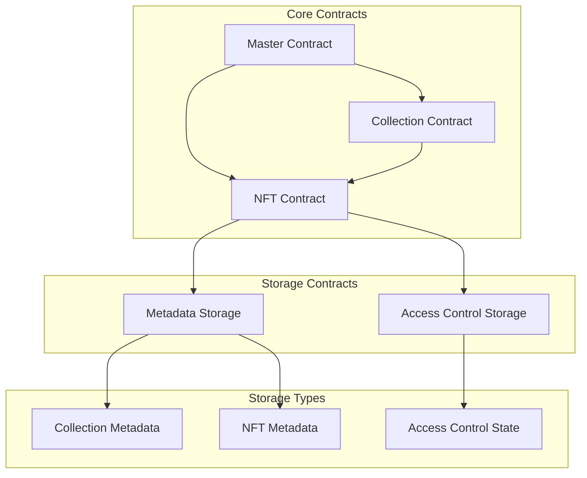

keys are saved at
`Saving key to '~/.near-cresdentials/testnet/your-account.testnet.json`

<br />

https://github.com/near/abi


# Modify Package.json

```json

{
  "name": "neuranft",
  "version": "1.0.0",
  "scripts": {
    "build:master": "BUILD_CONTRACT=master near-sdk-js build src/contract.js build/MasterAccess.wasm",
    "build:nft": "BUILD_CONTRACT=nft near-sdk-js build src/contract.js build/NFTContract.wasm",
    "build:collection": "BUILD_CONTRACT=collection near-sdk-js build src/contract.js build/Collection.wasm",
    "build:all": "npm run build:master && npm run build:nft && npm run build:collection",
    
    "test:master": "npm run build:master && ava tests/master.ava.js",
    "test:nft": "npm run build:nft && ava tests/nft.ava.js",
    "test:collection": "npm run build:collection && ava tests/collection.ava.js",
    "test": "npm run build:all && ava tests/**/*.ava.js",
    
    "deploy:master": "npm run build:master && near deploy --accountId YOUR_ACCOUNT_ID --wasmFile build/MasterAccess.wasm",
    "deploy:nft": "npm run build:nft && near deploy --accountId YOUR_ACCOUNT_ID --wasmFile build/NFTContract.wasm",
    "deploy:collection": "npm run build:collection && near deploy --accountId YOUR_ACCOUNT_ID --wasmFile build/Collection.wasm"
  }
}

```


# Project Structure

```

NeuraNFT/
├── src/
│   ├── contract.js              # Main entry point for all contracts
│   ├── master/
│   │   ├── master_contract.js   # Master access control contract
│   │   └── utils.js            # Master contract utilities
│   ├── nft/
│   │   ├── nft_contract.js     # NFT contract
│   │   ├── metadata.js         # NFT metadata implementation
│   │   └── utils.js            # NFT utilities
│   └── collection/
│       ├── collection_contract.js  # Collection contract
│       └── utils.js               # Collection utilities
├── tests/
│   ├── master.ava.js           # Master contract tests
│   ├── nft.ava.js             # NFT contract tests
│   └── collection.ava.js       # Collection contract tests
├── build/
│   ├── MasterAccess.wasm      # Built master contract
│   ├── NFTContract.wasm       # Built NFT contract
│   └── Collection.wasm        # Built collection contract
└── package.json


```


## Architecture

NeuraNFT's architecture is designed with security, scalability, and user control at its forefront. It consists of several key components:

