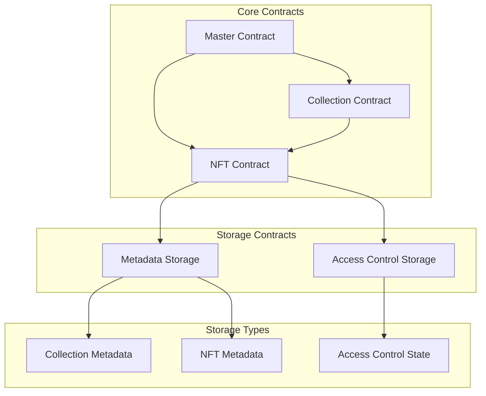

- [Build and Deploy Contract](#build-and-deploy-contract)
  - [1. Install Dependencies](#1-install-dependencies)
  - [Build the contract](#build-the-contract)
  - [Deploy the contract](#deploy-the-contract)
    - [Current Deployment](#current-deployment)
- [Project Structure](#project-structure)
- [Build Scripts](#build-scripts)
- [NEAR CLI Commands for NeuraNFT Contract](#near-cli-commands-for-neuranft-contract)
  - [Prerequisites](#prerequisites)
  - [Collection Management](#collection-management)
    - [Create a Collection](#create-a-collection)
    - [Update Collection](#update-collection)
  - [NFT Management](#nft-management)
    - [Create NFT](#create-nft)
    - [Transfer NFT](#transfer-nft)
    - [Set NFT Metadata](#set-nft-metadata)
    - [Set Access Level](#set-access-level)
    - [Burn NFT](#burn-nft)
  - [View Methods](#view-methods)
    - [Get Collection Info](#get-collection-info)
    - [Get NFT Info](#get-nft-info)
    - [Get NFT Metadata](#get-nft-metadata)
    - [Get User's NFTs](#get-users-nfts)
    - [Get All Collections](#get-all-collections)
    - [Get Collection NFTs](#get-collection-nfts)
    - [Get Access Level](#get-access-level)
    - [Get NFT Full Data](#get-nft-full-data)
    - [Get Collection Statistics](#get-collection-statistics)
  - [Architecture](#architecture)


# Build and Deploy Contract

## 1. Install Dependencies

```bash
npm install
```


## Build the contract
  
  There are 3 version of the contract that can be built:
  - Modular Build for testing individual contracts `index.js`
    - to build `npm run build`
    - to test `npm run test`
  - Optimized JS Build for deploying the contract `optimized-mini.js`
    - to build `npm run build:optimize`
    - to test `npm run test:optimize`
  - Optimized TS Build for deploying the contract `optimized-mini.ts`
    - to build `npm run build:optimizeTS`
    - to test `npm run test:optimizeTS` 

  ```bash
  npm run build
  ```

## Deploy the contract

  Create a new account on the NEAR Testnet and deploy the contract.

  **Create a new account**

  ```bash
  near create-account your-account.testnet --useFaucet
  ```
> keys are saved at `Saving key to '~/.near-cresdentials/testnet/your-account.testnet.json`

  **Deploy the contract**

  ```bash
  near deploy --accountId your-account.testnet --wasmFile build/NeuraNFTOptimizedTS.wasm
  
  OR

  near deploy your-account.testnet build/NeuraNFTOptimized.wasm

  ```

### Current Deployment

Contract deployed at
  - neuranft.testnet
  - neuranft_test1.testnet

# Project Structure

```

NeuraNFT/
├── README.md
├── config
│   └── build.config.js
├── package-lock.json
├── package.json
├── src
│   ├── core
│   │   ├── access_core.js
│   │   ├── collection_core.js
│   │   ├── metadata_core.js
│   │   └── nft_core.js
│   ├── index.js
│   ├── interfaces
│   │   ├── access_interface.js
│   │   ├── collection_interface.js
│   │   ├── metadata_interface.js
│   │   └── nft_interface.js
│   ├── master
│   │   └── master_contract.js
│   ├── models
│   │   ├── access.js
│   │   ├── collection.js
│   │   ├── index.js
│   │   ├── metadata.js
│   │   └── nft.js
│   ├── optimized-mini.js
│   ├── optimized-mini.ts
│   ├── standards
│   │   ├── nep171.js
│   │   ├── nep177.js
│   │   ├── nep181.js
│   │   └── nep_implementation.js
│   ├── storage
│   │   ├── state.js
│   │   └── storage_keys.js
│   └── utils
│       ├── assertions.js
│       ├── helpers.js
│       └── validation.js
├── tests
│   ├── master.ava.js
│   ├── optimized.ava.js
│   └── test.ava.js
├── tsconfig.json
├── types
│   └── near-sdk-js.d.ts
└── yarn.lock


```

# Build Scripts

```json

  "scripts": 
  {
    "build": "near-sdk-js build src/index.js build/NeuraNFT.wasm",
    "test": "$npm_execpath run build && ava tests/test.ava.js -- ./build/NeuraNFT.wasm",
    
    "build:master": "near-sdk-js build src/master/master_contract.js build/MasterAccess.wasm",
    "test:master": "$npm_execpath run build:master && ava tests/master.ava.js -- ./build/MasterAccess.wasm",
    
    "build:optimize": "near-sdk-js build --generateABI src/optimized-mini.js build/NeuraNFTOptimized.wasm",
    "test:optimize": "$npm_execpath run build:optimize && ava tests/optimized.ava.js -- ./build/NeuraNFTOptimized.wasm",
    
    "build:optimizeTS": "near-sdk-js build --generateABI src/optimized-mini.ts build/NeuraNFTOptimizedTS.wasm",
    "test:optimizeTS": "$npm_execpath run build:optimizeTS && ava tests/optimized.ava.js -- build/NeuraNFTOptimized.wasm"
  }

```

# NEAR CLI Commands for NeuraNFT Contract

## Prerequisites
```bash
# Make sure you're using testnet
export NEAR_ENV=testnet

# Login to your NEAR account if you haven't already
near login

```
Note: Replace `<contract-id>` with your actual contract ID (e.g., `contract.testnet`) and `<your-account.testnet>` with your NEAR testnet account.


## Collection Management

### Create a Collection
```bash
near call <contract-id> createCollection '{ 
  "name": "My AI Model Collection", 
  "contextWindow": 4096, 
  "baseModel": "GPT-4", 
  "image": "https://example.com/image.jpg", 
  "description": "Collection of fine-tuned models" 
}' --accountId <your-account.testnet>
```

### Update Collection
```bash
near call <contract-id> updateCollection '{
  "collectionId": 1,
  "name": "Updated Collection Name",
  "description": "New description"
}' --accountId <your-account.testnet>
```

## NFT Management

### Create NFT
```bash
near call <contract-id> createNFT '{
  "collectionId": 1,
  "name": "My AI Model NFT",
  "levelOfOwnership": 6
}' --accountId <your-account.testnet>
```

### Transfer NFT
```bash
near call <contract-id> transferNFT '{
  "collectionId": 1,
  "tokenId": 1,
  "receiverId": "recipient.testnet"
}' --accountId <your-account.testnet>
```

### Set NFT Metadata
```bash
near call <contract-id> setMetadata '{
  "collectionId": 1,
  "tokenId": 1,
  "metadata": {
    "image": "https://example.com/nft-image.jpg",
    "baseModel": "GPT-4",
    "data": "ipfs://QmXxx...",
    "description": "Fine-tuned model for specific task"
  }
}' --accountId <your-account.testnet>
```

### Set Access Level
```bash
near call <contract-id> setAccess '{
  "collectionId": 1,
  "tokenId": 1,
  "user": "user.testnet",
  "level": 2
}' --accountId <your-account.testnet>
```

### Burn NFT
```bash
near call <contract-id> burnNFT '{
  "collectionId": 1,
  "tokenId": 1
}' --accountId <your-account.testnet>
```

## View Methods

### Get Collection Info
```bash
near view <contract-id> getCollection '{"collectionId": 1}'
```

### Get NFT Info
```bash
near view <contract-id> getNFTInfo '{
  "collectionId": 1,
  "tokenId": 1
}'
```

### Get NFT Metadata
```bash
near view <contract-id> getMetadata '{
  "collectionId": 1,
  "tokenId": 1
}'
```

### Get User's NFTs
```bash
near view <contract-id> getUserNFTs '{
  "user": "user.testnet"
}'
```

### Get All Collections
```bash
near view <contract-id> getAllCollections '{}'
```

### Get Collection NFTs
```bash
near view <contract-id> getCollectionNFTs '{
  "collectionId": 1
}'
```

### Get Access Level
```bash
near view <contract-id> getAccessLevel '{
  "collectionId": 1,
  "tokenId": 1,
  "user": "user.testnet"
}'
```

### Get NFT Full Data
```bash
near view <contract-id> getNFTFullData '{
  "collectionId": 1,
  "tokenId": 1
}'
```

### Get Collection Statistics
```bash
near view <contract-id> getCollectionsFullInfo '{}'
```


## Architecture

NeuraNFT's architecture is designed with security, scalability, and user control at its forefront. It consists of several key components:

