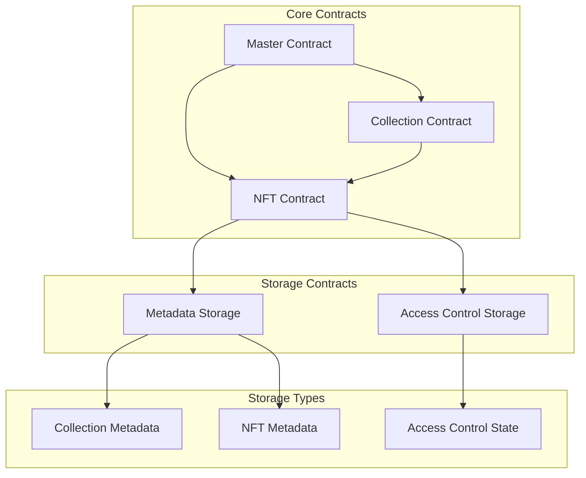

# Hello NEAR Contract

The smart contract exposes two methods to enable storing and retrieving a greeting in the NEAR network.

```ts
@NearBindgen({})
class HelloNear {
  greeting: string = "Hello";

  @view // This method is read-only and can be called for free
  get_greeting(): string {
    return this.greeting;
  }

  @call // This method changes the state, for which it cost gas
  set_greeting({ greeting }: { greeting: string }): void {
    // Record a log permanently to the blockchain!
    near.log(`Saving greeting ${greeting}`);
    this.greeting = greeting;
  }
}
```

<br />

# Quickstart

1. Make sure you have installed [node.js](https://nodejs.org/en/download/package-manager/) >= 16.
2. Install the [`NEAR CLI`](https://github.com/near/near-cli#setup)

<br />

## 1. Build and Test the Contract
You can automatically compile and test the contract by running:

```bash
npm run build
```

<br />

## 2. Create an Account and Deploy the Contract
You can create a new account and deploy the contract by running:

```bash
near create-account <your-account.testnet> --useFaucet
near deploy <your-account.testnet> build/release/hello_near.wasm
```

keys are saved at
`Saving key to '~/.near-cresdentials/testnet/your-account.testnet.json`

<br />

https://github.com/near/abi

## 3. Retrieve the Greeting

`get_greeting` is a read-only method (aka `view` method).

`View` methods can be called for **free** by anyone, even people **without a NEAR account**!

```bash
# Use near-cli to get the greeting
near view <your-account.testnet> get_greeting
```

<br />

## 4. Store a New Greeting
`set_greeting` changes the contract's state, for which it is a `call` method.

`Call` methods can only be invoked using a NEAR account, since the account needs to pay GAS for the transaction.

```bash
# Use near-cli to set a new greeting
near call <your-account.testnet> set_greeting '{"greeting":"howdy"}' --accountId <your-account.testnet>
```

**Tip:** If you would like to call `set_greeting` using another account, first login into NEAR using:

```bash
# Use near-cli to login your NEAR account
near login
```

and then use the logged account to sign the transaction: `--accountId <another-account>`.

# Modify Package.json

```json

{
  "name": "neuranft",
  "version": "1.0.0",
  "scripts": {
    "build:master": "BUILD_CONTRACT=master near-sdk-js build src/contract.js build/MasterAccess.wasm",
    "build:nft": "BUILD_CONTRACT=nft near-sdk-js build src/contract.js build/NFTContract.wasm",
    "build:collection": "BUILD_CONTRACT=collection near-sdk-js build src/contract.js build/Collection.wasm",
    "build:all": "npm run build:master && npm run build:nft && npm run build:collection",
    
    "test:master": "npm run build:master && ava tests/master.ava.js",
    "test:nft": "npm run build:nft && ava tests/nft.ava.js",
    "test:collection": "npm run build:collection && ava tests/collection.ava.js",
    "test": "npm run build:all && ava tests/**/*.ava.js",
    
    "deploy:master": "npm run build:master && near deploy --accountId YOUR_ACCOUNT_ID --wasmFile build/MasterAccess.wasm",
    "deploy:nft": "npm run build:nft && near deploy --accountId YOUR_ACCOUNT_ID --wasmFile build/NFTContract.wasm",
    "deploy:collection": "npm run build:collection && near deploy --accountId YOUR_ACCOUNT_ID --wasmFile build/Collection.wasm"
  }
}

```


# Project Structure

```

NeuraNFT_JS/
├── contract/
│   ├── src/
│   │   ├── master/
│   │   │   ├── master_contract.js       # Master contract implementation
│   │   │   └── access_control.js        # Access control logic
│   │   ├── nft/
│   │   │   ├── nft_contract.js         # Main NFT contract implementation
│   │   │   ├── nft_metadata.js         # NFT metadata handling
│   │   │   ├── nft_enumeration.js      # NFT enumeration methods
│   │   │   └── nft_core.js             # Core NFT operations (mint, burn, transfer)
│   │   ├── collection/
│   │   │   ├── collection_contract.js   # Collection contract implementation
│   │   │   └── collection_management.js # Collection management logic
│   │   └── utils/
│   │       ├── storage.js              # Storage management utilities
│   │       ├── assertions.js           # Common validation functions
│   │       └── types.js               # Type definitions and constants
│   ├── tests/
│   │   ├── master.test.js
│   │   ├── nft.test.js
│   │   └── collection.test.js
│   └── package.json
├── integration-tests/
│   ├── test-utils.js
│   └── integration.test.js
├── scripts/
│   ├── deploy.js                      # Deployment script
│   ├── build.js                       # Build script
│   └── init.js                        # Contract initialization
├── config/
│   ├── near_config.js                # NEAR network configuration
│   └── contract_config.js            # Contract-specific configuration
└── package.json


NeuraNFT/
├── src/
│   ├── contract.js              # Main entry point for all contracts
│   ├── master/
│   │   ├── master_contract.js   # Master access control contract
│   │   └── utils.js            # Master contract utilities
│   ├── nft/
│   │   ├── nft_contract.js     # NFT contract
│   │   ├── metadata.js         # NFT metadata implementation
│   │   └── utils.js            # NFT utilities
│   └── collection/
│       ├── collection_contract.js  # Collection contract
│       └── utils.js               # Collection utilities
├── tests/
│   ├── master.ava.js           # Master contract tests
│   ├── nft.ava.js             # NFT contract tests
│   └── collection.ava.js       # Collection contract tests
├── build/
│   ├── MasterAccess.wasm      # Built master contract
│   ├── NFTContract.wasm       # Built NFT contract
│   └── Collection.wasm        # Built collection contract
└── package.json


NeuraNFT_JS/
├── contract/
│   ├── src/
│   │   ├── master/
│   │   │   ├── index.ts                 # Master contract entry
│   │   │   ├── access.ts                # Access control logic
│   │   │   └── types.ts                 # Master contract types
│   │   ├── nft/
│   │   │   ├── index.ts                 # NFT contract entry
│   │   │   ├── metadata.ts              # NFT metadata implementation
│   │   │   ├── enumeration.ts           # NFT enumeration methods
│   │   │   ├── core.ts                  # Core NFT logic (mint, burn, transfer)
│   │   │   └── types.ts                 # NFT related types
│   │   ├── collection/
│   │   │   ├── index.ts                 # Collection contract entry
│   │   │   ├── management.ts            # Collection management logic
│   │   │   └── types.ts                 # Collection related types
│   │   └── storage/
│   │       ├── models.ts                # Storage models
│   │       └── implementation.ts        # Storage implementation
│   ├── assembly/                        # AssemblyScript specific code
│   │   └── index.ts
│   ├── tests/
│   │   ├── master.spec.ts
│   │   ├── nft.spec.ts
│   │   └── collection.spec.ts
│   └── package.json
├── integration-tests/
│   └── ts/
│       ├── main.ava.ts
│       └── utils.ts
├── scripts/
│   ├── deploy.sh
│   ├── build.sh
│   └── test.sh
└── package.json
```


## Architecture

NeuraNFT's architecture is designed with security, scalability, and user control at its forefront. It consists of several key components:

